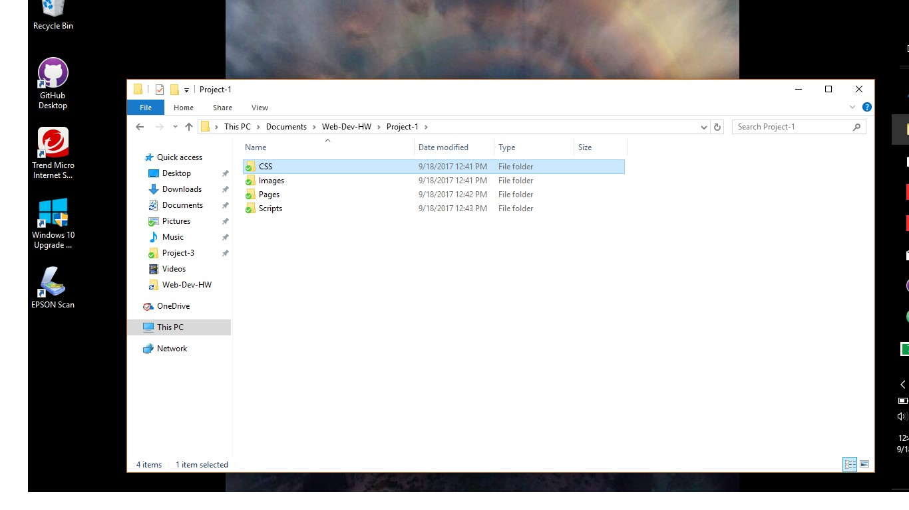

# Diana Creekmore
## My Readme.md

  

I have been having so much trouble with <b>Atom</b>, that it is very frustrating. I think I have it all figured out, then *blam*, I'm all confused again.

I learned the difference between `
` and` #`.

---

I have searched the web to get help for dummies, but it just makes me more confused.  One of the websites I used is [www.w3schools.com/html](www.w3schools.com/html) A lot of great tutorials.

Below are some of my problem areas

1. Github Desktop
2. Not being able to commit

- Wish this was a face-to-face class
- Thank goodness for Justine!

Here is my screenshot

